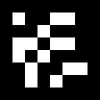
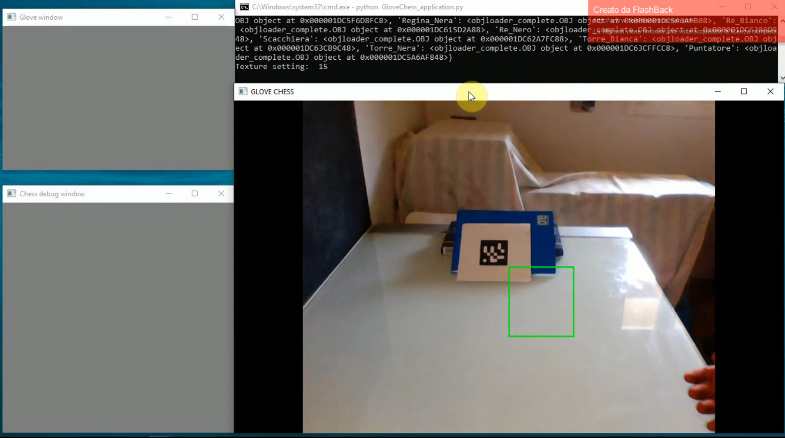
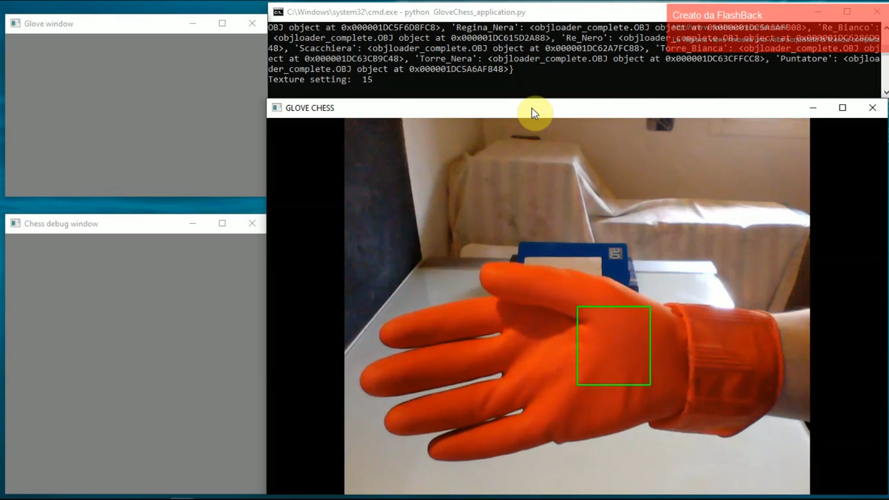
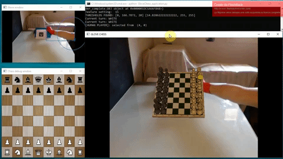
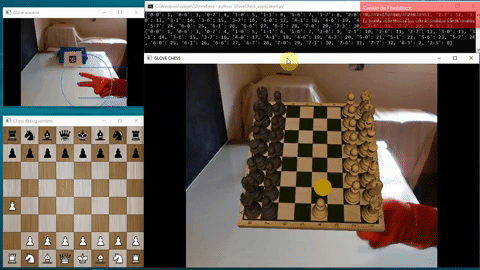
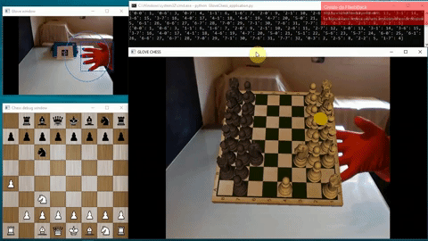

<p align="center">
  
</p>

GloveChess is an implementation of the chess game in augmented reality which exploit a hand tracker system as input for chess move.<br>
The whole application use Python, OpenCV and OpenGL

## Set up
Python v. 3.7.6<br>
Main python dependencies:
- [OpenCV 3.4.2](https://opencv.org/)
- [PyOpenGl](http://pyopengl.sourceforge.net/)
- [Numpy](https://numpy.org/)
- Pillow
- Pygame

The projection is marker-based using [ARuco](https://docs.opencv.org/trunk/d5/dae/tutorial_aruco_detection.html) module. In the project the following marker has been used, so be sure to get one
<p align="center">
  
</p>

Clone the repository<br>
```
git clone https://github.com/xAlessandroC/GloveChess
```
Install the dependencies<br>
```
pip3 install -r requirements.txt
```
Unfortunately there is some kind of problem with installing PyOpenGl with pip since the freeglut binaries won't be installed. To solve this problem
you have to search here https://www.lfd.uci.edu/~gohlke/pythonlibs/#pyopengl the PyOpenGl and PyOpenGl-accelerate binaries for your python version and install them.
In the resources/wheels you can find mine.

Launch the application<br>
```
python GloveChess_application.py
```

This is what you should get
<p align="center">
  
</p>


## Working application
Step 1: At the beginning the application need to acquire the color for hand detection, so put the hand in front of the green square and press 'd'
<p align="center">
  
</p>
Step 2: Now the game starts
<p align="center">
  
</p>

## How to make chess move
Since the projection of the chessboard happen over the hand we add a pointer that helps you to keep trace of the selected piece/cell.
Use your whole hand to move the selector
<p align="center">
  
</p>
Use two finger to selected the starting or ending cell
<p align="center">
  
</p>

Hint: you can use the terminal to know if the selection has been computed properly, sometimes some mistakes can happen

<!--## Extras
If you want to know the theory/work behind this project consult the [Wiki](https://github.com/xAlessandroC/GloveChess/wiki)-->

## Credits
Thanks to [Pietro Morisco](https://www.instagram.com/pietromoriscogd/?hl=it) for the  logo!<br>
Thanks to [printable_models](https://free3d.com/it/user/printable_models) for the chess 3D models
